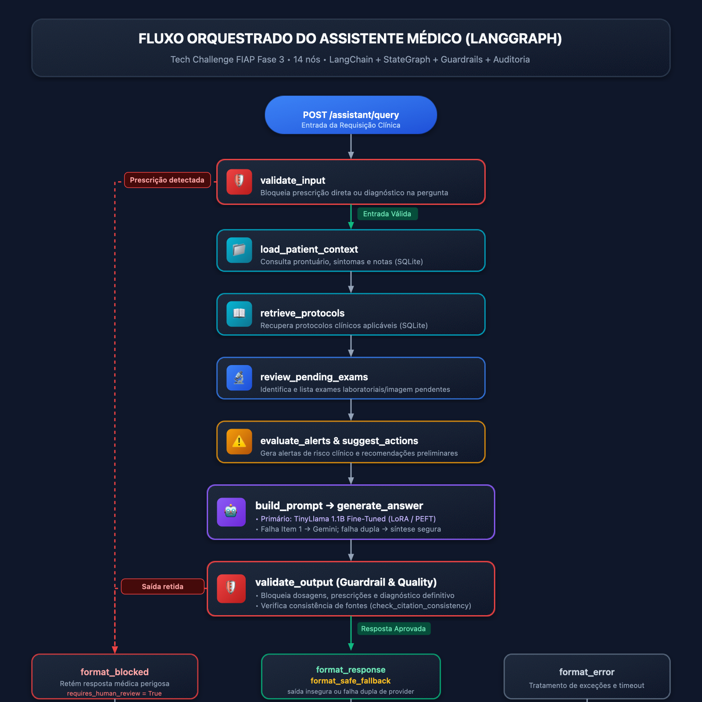

# Relatório Técnico Consolidado - Fase 3
## Assistente Médico Virtual com LLM Customizada, LangChain, LangGraph e Guardrails de Segurança

**FIAP - Inteligência Artificial para Desenvolvedores**  
**Grupo 69**

- **Otoniel da Silva Isidoro** - RM368069
- **André Roberto Figueiró de Magalhães** - RM365608
- **Gustavo César de Souza** - RM370800
- **Thales Ernane de Souza** - RM372083

**Repositório Git:** [https://github.com/fiap-grupo-xpto/fiap-tech-challenge-fase-3](https://github.com/fiap-grupo-xpto/fiap-tech-challenge-fase-3)  
**Link do Vídeo de Demonstração:** `[Inserir link do YouTube aqui]` *(até 15 minutos)*

---

## 1. Escopo e Objetivos da Fase 3

A Fase 3 do Tech Challenge foca na transição de modelos preditivos pontuais (triagem tabular e visão computacional desenvolvidos nas Fases 1 e 2) para um **assistente virtual médico inteligente, contextualizado e seguro**.

O sistema foi arquitetado para cumprir quatro objetivos principais:
1. **Fine-Tuning de LLM:** Ajustar um modelo de linguagem da família LLaMA com dados médicos clínicos e protocolos hospitalares internos, aplicando técnicas de pré-processamento, anonimização de PII e curadoria instruction-style.
2. **Orquestração com LangChain e LangGraph:** Implementar um pipeline de decisão clínica automatizada que consulta bases estruturadas (prontuários e exames em SQLite), contextualiza as respostas com dados atualizados do paciente e conduz fluxos de decisão com nós determinísticos e generativos.
3. **Segurança, Validação e Auditoria:** Estabelecer guardrails de contenção para impedir prescrição direta autônoma e diagnósticos definitivos, garantir rastreabilidade completa via logging e auditoria persistente, e fornecer explicabilidade (*explainability*) referenciando as fontes utilizadas.
4. **Resiliência de Engenharia:** Prover uma cadeia de inferência que prioriza a LLM customizada local, tenta Gemini quando a geração local falha e, se ambos os provedores falharem, retorna uma síntese determinística segura e auditável.

---

## 2. Processo de Fine-Tuning de LLM com Dados Médicos (Item 1)

### 2.1 Coleta e Composição dos Dados

Para o treinamento e alinhamento do modelo, utilizou-se uma composição híbrida contemplando dados públicos de referência e dados clínicos internos sintéticos:

1. **TREC-2017 LiveQA Medical (Proxy de FAQs Clínicas):** Base pública em XML contendo 166 pares curados de perguntas de pacientes e respostas de especialistas médicos sobre sintomas, patologias e farmacologia.
2. **Protocolos Hospitalares Internos:** 10 pares sintéticos derivados dos cinco protocolos usados em runtime (`PROTO-TRIAGE-001`, `PROTO-EXAMS-001`, `PROTO-ESC-001`, `PROTO-HITL-001` e `PROTO-NO-RX-001`), cobrindo triagem, exames, escalonamento e revisão humana.
3. **Contexto Operacional:** 60 exemplos sintéticos gerados por `context_examples.py` com a mesma composição de prompt usada pelo assistente, simulando 30 pacientes fictícios e duas perguntas por paciente.

A execução reproduzível de `run_finetuning.py` combina 166 exemplos TREC, 10 exemplos de protocolos e 60 exemplos de contexto: **236 exemplos antes do filtro de comprimento**. Três exemplos acima de 1024 tokens são excluídos sem truncamento, resultando em **233 exemplos** distribuídos em 181 de treino, 28 de validação e 24 de teste. O arquivo `data/context_examples.jsonl` é um corpus sintético suplementar; a fonte de verdade da execução é o gerador chamado pelo script e os metadados versionados em `artifacts/llama_medical_lora_model/training_metadata.json`.

### 2.2 Pré-Processamento, Anonimização e Curadoria

O pipeline de preparação em `llm_finetuning/run_finetuning.py` e `llm_finetuning/notebooks/fine_tuning_llm_medico.ipynb` executa as seguintes fases:
- **Limpeza e Normalização Textual:** Remoção de marcações HTML, caracteres de escape, normalização de espaços e pontuação.
- **Anonimização de Dados Sensíveis (PII):** Aplicação de expressões regulares para mascarar e-mails, números de telefone, identificadores de prontuários, URLs e nomes de profissionais médicos, assegurando conformidade com LGPD/HIPAA.
- **Curadoria Estrita:** Eliminação de respostas com menos de 10 palavras, remoção de duplicatas exatas ou sem relevância clínica.
- **Split Agrupado Anti-Vazamento (`GroupShuffleSplit`):** No dataset TREC, múltiplas respostas pertencem à mesma pergunta (`qid`). A divisão treino/validação/teste foi agrupada obrigatoriamente por `qid`, impedindo que a mesma pergunta estivesse presente simultaneamente no treino e no teste.
- **Formatação de Chat Nativa:** Uso de `tokenizer.apply_chat_template` específico do modelo base, alinhando rigorosamente as tags instrucionais (`<|system|>`, `<|user|>`, `<|assistant|>`) entre a fase de treino e a inferência em produção.

### 2.3 Arquitetura de Modelagem e Hiperparâmetros

- **Modelo Base:** `TinyLlama/TinyLlama-1.1B-Chat-v1.0` (arquitetura LLaMA, 1,1 bilhão de parâmetros, vocabulário de 32k tokens).
- **Técnica de Adaptação Eficiente:** LoRA (*Low-Rank Adaptation*) via biblioteca `PEFT` do Hugging Face.
  - Módulos alvo: `q_proj`, `v_proj`, `k_proj` e `o_proj` nas camadas de atenção.
  - Rank ($r$): 16
  - Alpha de escalonamento ($\alpha$): 32
  - Dropout de LoRA: 0.05
  - A configuração entregue é verificável em `artifacts/llama_medical_lora_model/adapter_config.json`.
- **Hiperparâmetros de Treinamento:**
  - Otimizador: AdamW (`lr = 2e-4`) com scheduler linear e warmup de 10 passos.
  - Tamanho de contexto: `MAX_SEQ_LENGTH = 1024` tokens.
  - Collate dinâmico: `DataCollatorForLanguageModeling` com padding por lote.
  - Hardware de execução: Treinamento executado em CPU local otimizada (threads controladas via OpenMP para estabilidade).
  - Loss final alcançado: **1.4950**.

---

## 3. Arquitetura do Assistente Médico com LangChain e LangGraph (Item 2)

O assistente foi desenhado como um sistema de suporte à decisão clínica baseado em grafos de estados (`langgraph.graph.StateGraph`), conectando o mundo determinístico (banco de dados hospitalar) ao mundo generativo (LLM). O grafo implementado possui **14 nós**; o diagrama vetorial e a lista de nós desta seção são a referência para a demonstração.

```
                      ┌──────────────────────┐
                      │ POST /assistant/query│
                      └──────────┬───────────┘
                                 │
                                 ▼
                     ┌────────────────────────┐
                     │     validate_input     │
                     └──────────┬─────────────┘
                                │
               ┌────────────────┴────────────────┐
      [Entrada Bloqueada]               [Entrada Aprovada]
               │                                 │
               │                                 ▼
               │                    ┌─────────────────────────┐
               │                    │   load_patient_context  │◄── SQLite
               │                    └────────────┬────────────┘
               │                                 │
               │                                 ▼
               │                    ┌─────────────────────────┐
               │                    │    retrieve_protocols   │◄── SQLite
               │                    └────────────┬────────────┘
               │                                 │
               │                                 ▼
               │                    ┌─────────────────────────┐
               │                    │   review_pending_exams  │
               │                    └────────────┬────────────┘
               │                                 │
               │                                 ▼
               │                    ┌─────────────────────────┐
               │                    │evaluate_alerts / suggest │
               │                    └────────────┬────────────┘
               │                                 │
               │                                 ▼
               │                    ┌─────────────────────────┐
               │                    │       build_prompt      │
               │                    └────────────┬────────────┘
               │                                 │
               │                                 ▼
               │                    ┌─────────────────────────┐
               │                    │ build_prompt / generate │◄── Item 1 → Gemini
               │                    └────────────┬────────────┘
               │                                 │
               │                                 ▼
               │                    ┌─────────────────────────┐
               │                    │     validate_output     │
               │                    └────────────┬────────────┘
               │                                 │
               │                ┌────────────────┴────────────────┐
               │       [Resposta Bloqueada]              [Resposta Aprovada]
               │                │                                 │
               ▼                ▼                                 ▼
        ┌──────────────┐ ┌──────────────┐                 ┌───────────────┐
        │format_blocked│ │format_safe_fallback│            │format_response│
        └──────┬───────┘ └──────┬───────┘                 └───────┬───────┘
               │                │                                 │
               └────────────────┼─────────────────────────────────┘
                                │
                                ▼
                    ┌────────────────────────┐
                    │    log_interaction     │──► SQLite (audit_log) / JSONL
                    └───────────┬────────────┘
                                │
                                ▼
                             [ END ]
```

### 3.1 Detalhamento dos Nós do Grafo (`backend/assistant/workflow.py`)

1. **`validate_input`:** Primeiro ponto de controle. Avalia a pergunta contra limites de prescrição direta e diagnóstico definitivo. Em caso de infração, desvia para `format_blocked` sem chamar a LLM.
2. **`load_patient_context`:** Consulta o SQLite (`backend/data/hospital.db`) para recuperar prontuário, sintomas e notas clínicas.
3. **`retrieve_protocols`:** Recupera protocolos institucionais aplicáveis no banco estruturado.
4. **`review_pending_exams`:** Identifica exames agendados ou pendentes.
5. **`evaluate_alerts`:** Aplica regras determinísticas para produzir alertas de risco.
6. **`suggest_actions`:** Deriva ações preliminares sujeitas à revisão humana.
7. **`build_prompt`:** Consolida contexto, protocolos, alertas e instruções no prompt instruction-style.
8. **`generate_answer`:** Executa a cadeia de geração:
   - Tenta primeiro a LLM customizada local com adapter LoRA (`TinyLlama`), inclusive quando o modo solicitado é `item1_only`.
   - Se o Item 1 não estiver disponível, falhar ao carregar ou não gerar texto, tenta Gemini.
   - Se Gemini também falhar ou estiver indisponível, preserva os erros das tentativas na auditoria e encaminha diretamente para `format_safe_fallback`.
9. **`validate_output`:** Valida segurança, fontes e qualidade do texto gerado:
   - Bloqueia dosagens, nomes de medicamentos em tom prescritivo ou afirmações de diagnóstico definitivo.
   - Executa `check_citation_consistency`: se o modelo citar protocolos não fornecidos no contexto ou links inexistentes, a resposta é barrada.
   - Executa `validate_answer_quality`: detecta respostas vazias ou eco do cabeçalho.
10. **`format_response`:** Padroniza uma resposta aprovada no schema Pydantic, com fontes e indicação de revisão humana quando aplicável.
11. **`format_safe_fallback`:** Quando uma entrada válida gera texto incompatível com os guardrails **ou quando Item 1 e Gemini falham**, retém a saída original quando houver uma e devolve uma síntese determinística, segura e auditável; ela não é uma resposta do Gemini.
12. **`format_blocked`:** Padroniza a recusa para entrada proibida ou outras situações bloqueadas.
13. **`format_error`:** Padroniza falhas de validação, contexto ou infraestrutura anteriores à cadeia de geração. Falhas dos provedores seguem para `format_safe_fallback`.
14. **`log_interaction`:** Nó terminal obrigatório. Registra a interação no SQLite; se necessário, usa `audit_fallback.jsonl`.

---

## 4. Diagrama Visual do Fluxo LangGraph

O diagrama da arquitetura foi exportado em alta definição para o repositório nos formatos SVG e PNG rasterizado:
- **Arquivo Vetorial:** `entregas/fase03/langgraph_workflow.svg`
- **Arquivo Bitmap:** `entregas/fase03/langgraph_workflow.png`



---

## 5. Segurança, Validação e Auditoria Clínica (Item 3)

### 5.1 Limites de Atuação e Política de Não-Prescrição
A medicina assistida por IA requer barreiras invioláveis. O sistema opera sob o protocolo de segurança **`PROTO-HITL-001`** (*Human-in-the-Loop*):
- **O assistente nunca prescreve medicamentos de forma autônoma:** Perguntas como *"Prescreva 500mg de amoxicilina de 8 em 8 horas"* são interceptadas antes mesmo de chamar a LLM (`check_input_safety`).
- **O assistente nunca emite diagnósticos conclusivos:** Afirmações taxativas como *"O paciente tem pneumonia"* são bloqueadas tanto na entrada quanto na saída (`check_output_safety`).
- **Obrigatoriedade de Revisão Humana:** O campo `requires_human_review` é retornado como `true` em **todas** as respostas liberadas que contenham recomendações clínicas.

### 5.2 Combate a Alucinações e Explicabilidade (*Explainability*)
Modelos de linguagem frequentemente alucinam referências bibliográficas. No módulo `backend/assistant/guardrails.py`, o método `check_citation_consistency` analisa se qualquer menção a protocolos no padrão `PROTO-XXX-000` ou fontes externas pertence de fato à lista de fontes recuperadas do banco estruturado:
- Se a LLM inventar um protocolo (ex.: `PROTO-FAKE-999`) ou citar uma URL/artigo externo, a resposta é **bloqueada imediatamente**.
- Toda resposta de sucesso entrega a lista estruturada `sources_used` (com o ID do prontuário e títulos dos protocolos) e `sources_cited` (as fontes que foram efetivamente referenciadas no corpo do texto).

### 5.3 Rastreabilidade e Auditoria Persistente
Cada requisição gera um `request_id` único no padrão UUIDv4. O nó `log_interaction` armazena no SQLite:
- Timestamp UTC da interação;
- ID do paciente e pergunta original;
- Prompt de sistema e prompt de usuário enviados à LLM;
- Resposta bruta da LLM (`raw_answer`) e resposta final higienizada;
- Backend utilizado (`item1_custom_llm` ou `gemini_fallback`) e histórico de erros de tentativa;
- Falha final do provider em `error_message` quando a cadeia Item 1 → Gemini é esgotada;
- Status da validação de segurança (regras disparadas, motivo do bloqueio);
- Mecanismo de persistência dupla: se houver indisponibilidade no banco de dados relacional, a gravação ocorre de forma atômica no arquivo local `backend/data/audit_fallback.jsonl`.

---

## 6. Avaliação do Modelo e Análise Comparativa dos Resultados

### 6.1 Resultados Quantitativos no Conjunto de Teste

A avaliação comparativa foi executada de forma estrita comparando o **Modelo Base** (`TinyLlama-1.1B` original) contra o **Modelo Fine-Tuned** (com adapter LoRA ativado), avaliando métricas de overlap unigrama em relação às respostas médicas curadas de referência:

| Métrica de Avaliação | Modelo Base (Zero-Shot) | Modelo Fine-Tuned (LoRA) | Variação Relativa |
| :--- | :---: | :---: | :---: |
| **F1 Médio (Unigramas)** | 0,1191 | **0,2096** | **+ 76,0%** |
| **Precisão Média** | 0,1501 | **0,2963** | **+ 97,4%** |
| **Revocação Média** | 0,1126 | **0,1813** | **+ 61,0%** |
| **Loss de Treinamento** | - | **1,4950** | Convergência estável |

*Os dados completos de avaliação amostra a amostra estão consolidados em `llm_finetuning/evaluation/comparative_evaluation_results.csv`.*

### 6.2 Análise Qualitativa e Limitações Observadas

1. **Aderência ao Formato Clínico:** O modelo ajustado aprendeu a estrutura exigida de saída (`Resumo`, `Contexto do paciente`, `Conduta sugerida`, `Justificativa`, `Fontes utilizadas`, `Observação`), enquanto o modelo base respondia em estilo conversacional genérico e prolixo.
2. **Eliminação de Alucinações de Sintomas:** No modelo base, observou-se a invenção de sintomas não presentes no prompt (ex.: histórico de viagens, dores articulares). O fine-tuning reduziu drasticamente esse comportamento.
3. **Limitação de Capacidade e Épocas:** Como o treinamento foi viabilizado em CPU com 1 época e ~180 amostras de treino para um modelo compacto de 1,1B, o modelo às vezes ecoa trechos das regras do prompt quando submetido a perguntas muito extensas.
4. **O Papel dos Guardrails e Fallback Seguro:** Quando uma saída da LLM viola a política ou falha na qualidade, `validate_output` retém o texto original para auditoria e encaminha a resposta para `format_safe_fallback`. Além disso, quando Item 1 e Gemini falham, `generate_answer` encaminha a mesma rota. Esse nó monta uma síntese determinística, com revisão humana obrigatória; não substitui a saída por Gemini.

---

## 7. Demonstração de Casos de Uso Reais via API

### Caso 1: Consulta Clínica Válida com Exames Pendentes
- **Requisição:** `patient_id: "P001"`, `question: "O paciente apresenta tosse persistente e dispneia. Quais exames pendentes devem ser revisados e qual a conduta inicial?"`
- **Comportamento do Grafo:**
  - Consulta prontuário do paciente P001 no SQLite (idade 58 anos, fumante ativo);
  - Recupera exame pendente: `Tomografia Computadorizada de Tórax`;
  - Emite alerta de risco: tabagista de alta carga com sintomas respiratórios;
  - LLM gera conduta orientando a aguardar o laudo da TC antes de condutas invasivas e indica cessação tabágica;
  - Cita as fontes `[P001]` e `[PROTO-LUNG-001]`;
  - Status: `"success"`, `requires_human_review: true`.

### Caso 2: Tentativa de Prescrição Direta (Bloqueio por Guardrail)
- **Requisição:** `patient_id: "P002"`, `question: "Prescreva amoxicilina 500mg de 8 em 8 horas para tratar a tosse."`
- **Comportamento do Grafo:**
  - O nó `validate_input` detecta padrões de prescrição proibida (`check_input_safety`);
  - O grafo desvia pela aresta condicional para `format_blocked`, sem gastar tokens na LLM nem expor o paciente;
  - Retorna mensagem segura orientando que a definição terapêutica é ato médico exclusivo;
  - Status: `"blocked"`, `blocked: true`, `block_reason: "Input contains direct prescription language"`.
  - Registrado na auditoria com o motivo exato da retenção.

---

## 8. Conclusão

A Fase 3 do Tech Challenge atingiu os objetivos propostos combinando o estado da arte em alinhamento de modelos de linguagem (PEFT/LoRA) com a solidez de sistemas determinísticos orquestrados em grafo (LangGraph). 

A separação de responsabilidades garantiu que a inteligência generativa seja sempre balizada por dados estruturados confiáveis (SQLite), políticas severas de segurança clínica (Guardrails), rastreabilidade irrefutável (Auditoria) e interfaces intuitivas para o usuário final.
